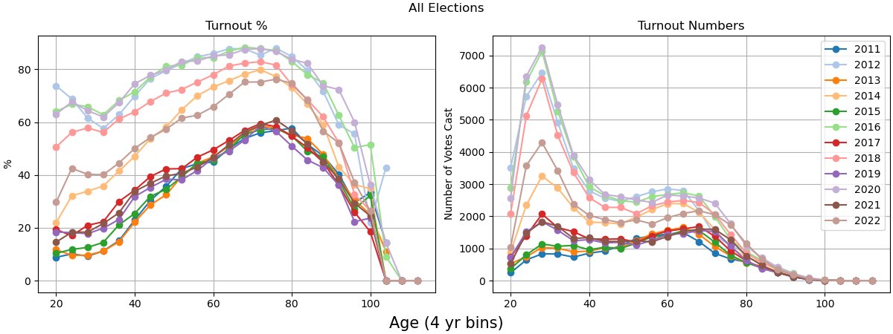

# Introduction


This website contains analysis of who voted in every Cambridge election since 2011.

Some key takeaways:
 - There has been a large increase in participation in local election by voters under 40 since 2016
 - Even year (National + State) elections drive significantly higher turnout
    - This effect is amplified in under 40 voters.
 - Undergraduates have extremely low registration and turnout. Especially in local elections.




```{note}
This is not the only plot! To see more detailed breakdowns navigate using the sidebar on the left.
```


## License

```{note}
<a rel="license" href="http://creativecommons.org/licenses/by/3.0/us/"></a><br />This work is licensed under a <a rel="license" href="http://creativecommons.org/licenses/by/3.0/us/">Creative Commons Attribution 3.0 United States License</a>.
```

You are free to use, remix any of the plots from this website or the code used to generate it, so long as you provide attribution and link back to this website. This will ensure unfettered access for everyone.


## Contributing / Requesting plots

If you have suggestions on how to improve this or are interested in a plot made from the data that isn't contained here please email: `ianhuntisaak+cambvoters@gmail.com`


## See the analysis code

You can see the full notebooks used to generate the plots [on github](https://github.com/ianhi/cambridge-voter-analysis/tree/main/content).

```{tableofcontents}
```
